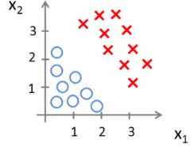
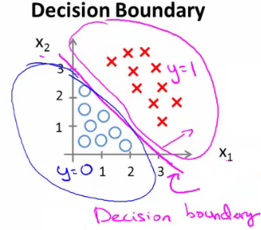

# Week 3

[TOC]

## Classification and Representation

### Classsification

* to determine what class a new input should fall into, \\(y \in \{0, 1, ..., n\}\\) 
* start with two classes: Yes or No

### Hypothesis Representation

* To change our hypotheses \\(h_θ(x)\\) to satisfy \\(0 \leq h_\theta (x) \leq 1\\) . 
* Our new form uses the "Sigmoid Function", also called the "Logistic Function":
  * \\(\begin{align*}& h_\theta (x) = g ( \theta^T x )\end{align*}\\) 
  * \\(\begin{align*} z = \theta^T x \end{align*}\\) 
  * \\(\begin{align*} g(z) = \dfrac{1}{1 + e^{-z}}\end{align*}\\) 
    * \\(e\\) : Exponents 
* The following image shows us what the sigmoid function looks like:
  * 
* Interpreting hypothesis output, we can use:
  * \\(h_\theta(x) = P(y=1 | x ; \theta)\\) , it give us the **probability** that output is 1.

### Decision Boundary

* In order to get our discrete 0 or 1 classification, we can translate the output of the hypothesis function as follows:
  * \\(\begin{align*}& h_\theta(x) \geq 0.5 \rightarrow y = 1 \newline& h_\theta(x) < 0.5 \rightarrow y = 0 \newline\end{align*}\\) 
  * so \\(\begin{align*}& g(z) \geq 0.5 , when \; z \geq 0\end{align*}\\) 
    * \\(\begin{align*}z=0, e^{0}=1 \Rightarrow g(z)=1/2\newline z \to \infty, e^{-\infty} \to 0 \Rightarrow g(z)=1 \newline z \to -\infty, e^{\infty}\to \infty \Rightarrow g(z)=0 \end{align*}\\) 
  * so if our input to \\(g\\) is \\(\theta^TX\\) , then that means: \\(\begin{align*}& h_\theta(x) = g(\theta^T x) \geq 0.5 , when \; \theta^T x \geq 0\end{align*}\\) 
* Sample:
* \\(h_\theta(x) = g(\theta_0 + \theta_1x_1 + \theta_2x_2)\\) :
* 
* \\(\theta_0 = -3, \theta_1 = 1, \theta_2 = 1\\) 
* So our parameter vector is a column vector with the above values: \\(\theta = \begin{bmatrix} -3\\1\\1\end{bmatrix}\\) 
* Then \\(z\\) becomes \\(\theta^TX\\) 
* We predict " \\(y=1\\) " if 
  * \\(-3x_0 + 1x_1 + 1x_2 \geq 0\\) 
  * \\(-3 + x_1 + x_2 \geq 0\\) 
  * \\(x_1 + x_2 \geq 3\\) 
* So\\(x_1 + x_2 = 3\\) we graphicallly plot our decision boundary:
  * 
  * Means:
    * Blue = false, Magenta = true
    * Line = decision boundary

### Non-linear decision boundaries

* Get logistic regression to fit a complex non-linear data set
* \\(h_\theta(x) = g(\theta_0 +\theta_1x_1 + \theta_2x_2 + \theta_3x_1^2 + \theta_4x_2^2)\\) 
* Say \\(\theta^T = \begin{bmatrix}-1, 0, 0, 1, 1\end{bmatrix}\\) :
* Predict that " \\(y = 1\\) ", if \\(x_1^2 + x_2^2 \geq 1\\) 
* If we plot \\(x_1^2 + x_2^2 = 1\\) , then this gives us a circle with a radius of 1 around 0:
  * 
* Mean we can build more complex decision boundaries by fitting complex parameters to this (relatively) simple hypothesis

## Logistic Regression Model

### Cost function

* Define the optimization object for the cost function we use to fit the parameters
  * Training set: \\(\{(x^{(1)}, y ^ {(1)}), (x^{(2)}, y ^ {(2)}),... , (x^{(m)}, y ^ {(m)}) \}\\) 
  * m example: \\(x \in \begin{bmatrix}x_0\\ x_1\\ ... \\ x_n \end{bmatrix};  x_0 = 1, y \in \{0, 1\}\\) 
  * \\(h_\theta(x) = \dfrac{1}{1 + e^{-\theta^Tx}}\\) 
    * Each example is a feature vector which is \\(n+1\\) dimensional
* Linear regression uses the following function to determine \\(\theta\\)
  * \\(J(\theta) = \dfrac {1}{m} \displaystyle \sum _{i=1}^m \dfrac{1}{2}\left (h_\theta (x_{i}) - y_{i} \right)^2\\) 
  * define\\(cost()\\) function to simplify the function:
    * \\(Cost(h_\theta(x_i), y) = \dfrac{1}{2}(h_\theta(x_i) - y_i)^2\\) 
  * then we got:
    * \\( J(\theta) = \dfrac{1}{m} \displaystyle \sum_{i=1}^m \mathrm{Cost}(h_\theta(x_i),y_i)\\) 
  * to further simplify it, will be:
    * \\( J(\theta) = \dfrac{1}{m} \displaystyle \sum_{i=1}^m \mathrm{Cost}(h_\theta(x),y)\\) 
    * If we use this function for logistic regression, this is a **non-convex function** for parameter optimization.
  * non-convex (with many local optima)
    * 
* A convex logistic regression cost function
  * \\(\begin{align*} & \mathrm{Cost}(h_\theta(x),y) = -\log(h_\theta(x)) \; & \text{if y = 1} \newline & \mathrm{Cost}(h_\theta(x),y) = -\log(1-h_\theta(x)) \; & \text{if y = 0}\end{align*}\\) 
  * 
  * 
  * \\(\begin{align*}& \mathrm{Cost}(h_\theta(x),y) = 0 \text{ if } h_\theta(x) = y \newline & \mathrm{Cost}(h_\theta(x),y) \rightarrow \infty \text{ if } y = 0 \; \mathrm{and} \; h_\theta(x) \rightarrow 1 \newline & \mathrm{Cost}(h_\theta(x),y) \rightarrow \infty \text{ if } y = 1 \; \mathrm{and} \; h_\theta(x) \rightarrow 0 \newline \end{align*}\\) 

### Simplified cost function and gradient descent

* Compress cost function's two conditional cases into one case:
  * \\(\mathrm{Cost}(h_\theta(x),y) = - y \; \log(h_\theta(x)) - (1 - y) \log(1 - h_\theta(x))\\) 
* Then we can fully write out our entire cost function as follows:
  * \\(J(\theta) = - \frac{1}{m} \displaystyle \sum_{i=1}^m [y^{(i)}\log (h_\theta (x^{(i)})) + (1 - y^{(i)})\log (1 - h_\theta(x^{(i)}))]\\) 
  * and a vectorized implementation is:
    * \\(\begin{align*} & h = g(X\theta)\newline & J(\theta) = \frac{1}{m} \cdot \left(-y^{T}\log(h)-(1-y)^{T}\log(1-h)\right) \end{align*}\\) 
* **Gradient Descent**
  * the general form is:
    * \\(\begin{align*}& Repeat \; \lbrace \newline & \; \theta_j := \theta_j - \alpha \dfrac{\partial}{\partial \theta_j}J(\theta) \newline & \rbrace\end{align*}\\) 
  * We can work out the derivative part using calculus to get:
    * \\(\begin{align*} & Repeat \; \lbrace \newline & \; \theta_j := \theta_j - \frac{\alpha}{m} \sum_{i=1}^m (h_\theta(x^{(i)}) - y^{(i)}) x_j^{(i)} \newline & \rbrace \end{align*}\\) 
  * A vectorized implementation is:
    * \\(\theta := \theta - \frac{\alpha}{m} X^{T} (g(X \theta ) - \vec{y})\\) 

### Advanced Optimization

* Alternatively, instead of gradient descent to minimize the cost function we could use

  * **Conjugate gradient** 
  * **BFGS** (Broyden-Fletcher-Goldfarb-Shanno)
  * **L-BFGS** (Limited memory - BFGS)

* Some properties

  - **Advantages**
    - No need to manually pick alpha (learning rate)
      - Have a clever inner loop (line search algorithm) which tries a bunch of alpha values and picks a good one
      - Often faster than gradient descent
        - Do more than just pick a good learning rate
      - Can be used successfully without understanding their complexity
  - **Disadvantages**
    - Could make debugging more difficult
    - Should not be implemented themselves
    - Different libraries may use different implementations - may hit performance

* Using advanced cost minimization algorithms

  * Example:

    * \\(\theta = \begin{bmatrix}\theta_1\\ \theta_2\end{bmatrix}\\)
    * \\(J(\theta) = (\theta_1 - 5)^2 + (\theta_2 - 5)^2\\)
    * \\(\dfrac{\partial}{\partial \theta_1}J(\theta) = 2(\theta_1 - 5)\\)
    * \\(\dfrac{\partial}{\partial \theta_2}J(\theta) = 2(\theta_2 - 5)\\)
    * Example above
      * \\(θ_1\\) and \\(θ_2\\) (two parameters)
      * Cost function here is \\(J(\theta) = (\theta_1 - 5)^2 + (\theta_2 - 5)^2\\) 
      * The derivatives of the \\(J(θ)\\)  with respect to either \\(θ_1\\) and \\(θ_2\\) turns out to be the \\(2(θ_i - 5)\\) 

  * First, define our cost function:

  * > function [jVal, gradient] = costFunction(theta)
    >   jVal = [...code to compute J(theta)...];
    >   gradient = [...code to compute derivative of J(theta)...];
    > end

  * In this case, 

    * `jVal` = \\((\theta_1 - 5)^2 + (\theta_2 - 5)^2\\) 
    * `gradient` is a 2 by 1 vector, and 2 elements are the two partial derivative terms

  * > options = optimset('GradObj', 'on', 'MaxIter', 100);
    > initialTheta = zeros(2,1);
    >    [optTheta, functionVal, exitFlag] = fminunc(@costFunction, initialTheta, options);

  * Here,

    * **options** is a data structure giving options for the algorithm
    * **fminunc**
      * function minimize the cost function (**f**ind **min**imum of **unc**onstrained multivariable function)
    * **@costFunction** is a pointer to the costFunction function to be used

  * For the octave implementation

    * **initialTheta** must be a matrix of at least two dimensions 

## Multiclass Classification: One-vs-all

* Divide our problem into n+1 (+1 because the index starts at 0) binary classification problems; in each one, we predict the probability that `y` is a member of one of our classes.
  * \\(\begin{align*}& y \in \lbrace0, 1 ... n\rbrace \newline& h_\theta^{(0)}(x) = P(y = 0 | x ; \theta) \newline& h_\theta^{(1)}(x) = P(y = 1 | x ; \theta) \newline& \cdots \newline& h_\theta^{(n)}(x) = P(y = n | x ; \theta) \newline& \mathrm{prediction} = \max_i( h_\theta ^{(i)}(x) )\newline\end{align*}\\) 
  * The following image show how one could classify 3 classes:
    * 
* Overall
  * Train a logistic regression classifier \\(h_{θ}^{(i)}(x)\\) for each class i to predict the probability that \\(y = i\\) 
  * On a new input, \\(x\\) to make a prediction, pick the class \\(i\\) that maximizes the probability that \\(h_θ^{(i)}(x) = 1\\) 

## The Problem of Overfitting

### Problems:

* Three figures to shows that **underfitting**, **fitting** and **overfitting**: (take housing price as sample)
  * 
  * underfitting or high bias: leftmost, \\(y = θ_0 + θ_1x\\) , doesn't really lie on straight line.
  * overfitting: rightmost, \\(y = \sum_{j=0} ^5 \theta_j x^j\\) , not a good predictor.
  * fitting one: \\(y = \theta_0 + \theta_1x + \theta_2x^2\\) , obtain a slightly better fit to the data.

### Addressing overfitting

* Reduce the number of features:
  * Manually select which features to keep.
  * Use a model selection algorithm.
* Regularation
  * Keep all the features, but reduce the magnitude of parameters \\(\theta_j\\) .
  * Regularation works well when we have a lot of slightly useful features.

### Cost Function

* if we have overfitting from our hypothesis function , we can reduce the weight that some of the terms in our function carry by increasing their cost.
* Say we wanted to make the following function more quadratic:
  * \\(\theta_0 + \theta_1x + \theta_2x^2 + \theta_3x^3 + \theta_4x^4\\) 
* We'll want to eliminate the influence of \\(\theta_3x^4\\) and \\(\theta_4x^4\\) . Without actuaully getting rid of these features or changing the form of our hypothesis, we can instead modify our cost function:
  * \\(min_\theta\ \dfrac{1}{2m}\sum_{i=1}^m (h_\theta(x^{(i)}) - y^{(i)})^2 + 1000\cdot\theta_3^2 + 1000\cdot\theta_4^2\\) 
  * Add two extra terms at the end to inflate the cost of \\(\theta_3\\) and \\(\theta_4\\) . This will in turn greatly reduce the values of \\(\theta_3x^4\\) and \\(\theta_4x^4\\) in our hypothesis function.
* We could also regularize all of our theta parameters in a single summation as:
  * \\(min_\theta\ \dfrac{1}{2m}\ \left[ \sum_{i=1}^m (h_\theta(x^{(i)}) - y^{(i)})^2 + \lambda\ \sum_{j=1}^n \theta_j^2 \right]\\) 
  * \\(\lambda\\) (lambda), is the **regularization parameter**. It determines how much the costs of our theta parameters are inflated.
  * But if lambda is choosen to be too large, it may smooth out the function too much and cause underfitting. 

### Regularized Linear Regression

* Gradient Descent

  > \\(\begin{align*} & \text{Repeat}\ \lbrace \newline & \ \ \ \ \theta_0 := \theta_0 - \alpha\ \frac{1}{m}\ \sum_{i=1}^m (h_\theta(x^{(i)}) - y^{(i)})x_0^{(i)} \newline & \ \ \ \ \theta_j := \theta_j - \alpha\ \left[ \left( \frac{1}{m}\ \sum_{i=1}^m (h_\theta(x^{(i)}) - y^{(i)})x_j^{(i)} \right) + \frac{\lambda}{m}\theta_j \right] &\ \ \ \ \ \ \ \ \ \ j \in \lbrace 1,2...n\rbrace\newline & \rbrace \end{align*}\\) 

  * The term \\(\frac{\lambda}{m}\theta_j\\) performs our regularization. With some manipulation our update rule can also be represented as:
    * \\(\theta_j := \theta_j(1 - \alpha\frac{\lambda}{m}) - \alpha\frac{1}{m}\sum_{i=1}^m(h_\theta(x^{(i)}) - y^{(i)})x_j^{(i)}\\) 
  * The first term in the above equation, \\(1 - \alpha\frac{\lambda}{m}\\) will always be less than 1. Intuitively you can see it as reducing the value of \\(θ_j\\) by some amount on every update. Notice that the second term is now exactly the same as it was before.

* Normoal Equation

  * To add in reguarization, the equation is the same as our original, except that we add another term inside the parentheses:
    * \\(\begin{align*}& \theta = \left( X^TX + \lambda \cdot L \right)^{-1} X^Ty \newline& \text{where}\ \ L = \begin{bmatrix} 0 & & & & \newline & 1 & & & \newline & & 1 & & \newline & & & \ddots & \newline & & & & 1 \newline\end{bmatrix}\end{align*}\\) 
    * L is a matrix with 0 at the top left and 1's down the diagonal, with 0's everywhere else. It should have dimension (n+1)×(n+1). Intuitively, this is the identity matrix (though we are not including \\(x_0\\) ), multiplied with a single real number \\(λ\\) .
    * Recall that if \\(m ≤ n\\) , then \\(X^TX\\) is non-invertible. However, when we add the term \\(λ⋅L\\) , then \\(X^TX + λ⋅L\\) becomes invertible.

* Cost function:
  * \\(J(\theta) = - \frac{1}{m} \sum_{i=1}^m \large[ y^{(i)}\ \log (h_\theta (x^{(i)})) + (1 - y^{(i)})\ \log (1 - h_\theta(x^{(i)})) \large]\\) 
* Regularize this equation by adding a term to the end:
  * \\(J(\theta) = - \frac{1}{m} \sum_{i=1}^m \large[ y^{(i)}\ \log (h_\theta (x^{(i)})) + (1 - y^{(i)})\ \log (1 - h_\theta(x^{(i)}))\large] + \frac{\lambda}{2m}\sum_{j=1}^n \theta_j^2\\) 
  * The second sum, \\(\sum_{j=1}^n \theta_j^2\\) **means to explicitly exclude the bias term, \\(\theta_0\\) . I.e. the \\(\theta\\) vector is indexed from 0 to n (holding n+1 values, \\(\theta_0\\) through \\(\theta_n\\) ), and this sum explicitly skips \\(\theta_0\\) , by running from 1 to n, skipping 0 (This is because for regularization we don't penalize \\(θ_0\\) so treat it slightly differently). Thus, when computing the equation, we should continously update the two following equations:
  * 

## Words 

**logistic** [ləu'dʒistik] adj. [数] 符号逻辑的

**fraudulent** ['frɔ:djulənt] adj. 欺骗性的；不正的

**malignant** [mə'liɡnənt] adj. [医] 恶性的；

**benign** [bi'nain] adj. 良性的；

**polynomial** [,pɔli'nəumiəl] n. [数] 多项式；

**quadratic** [kwɔ'drætik] adj. [数] 二次的 n. 二次方程式;

**penalize**    ['pi:nəlaiz] vt. 处罚；处刑；使不利

**sigmoid function** ['sigmɔid] 双弯曲函数

