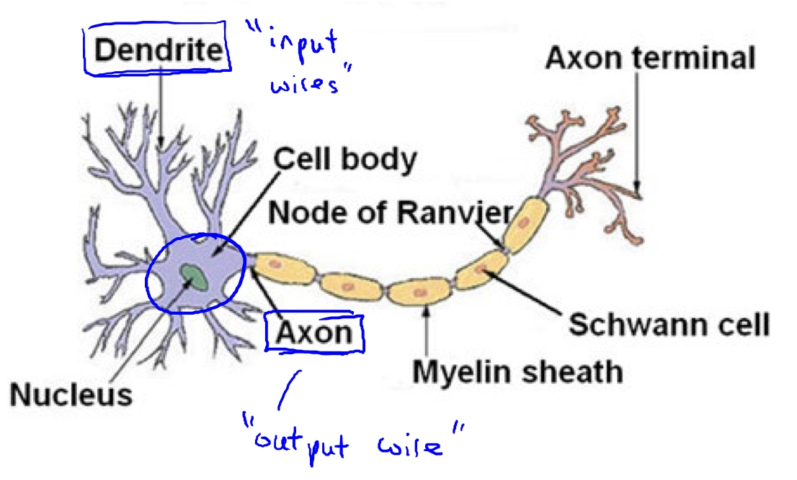
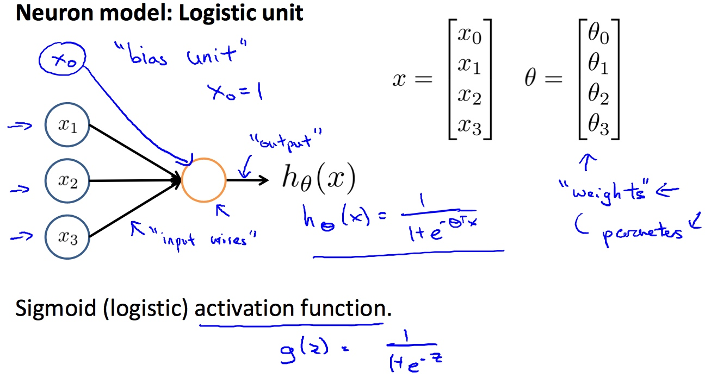
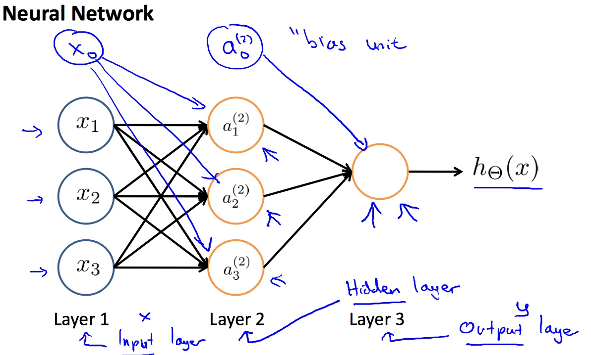
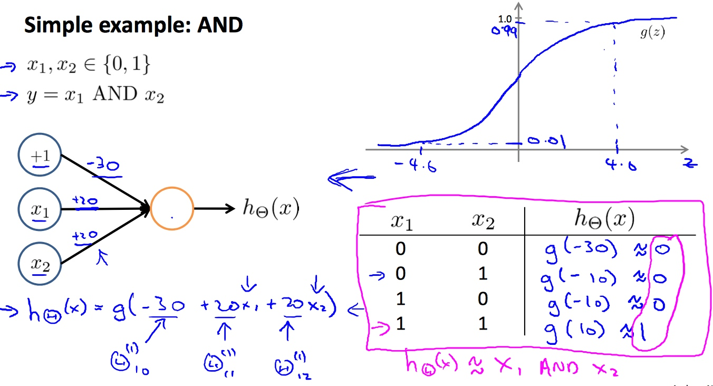
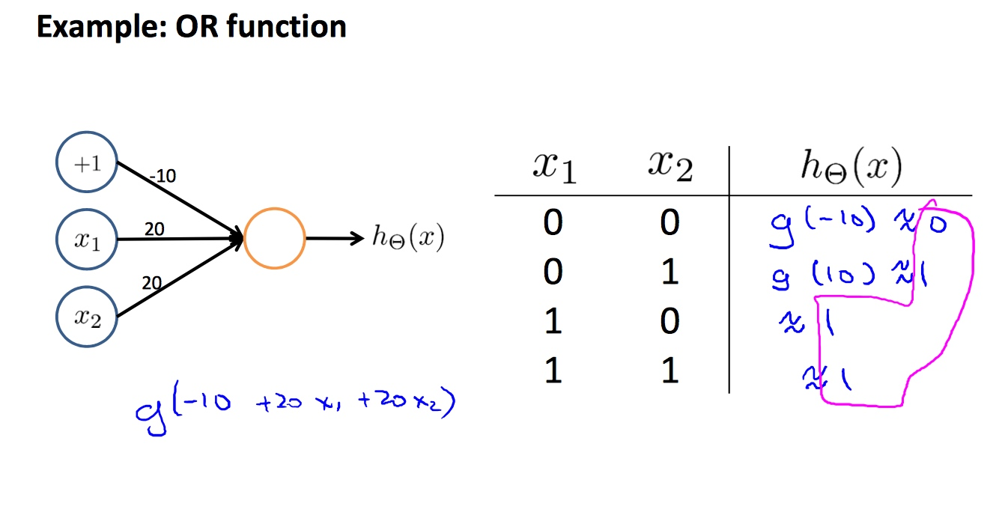
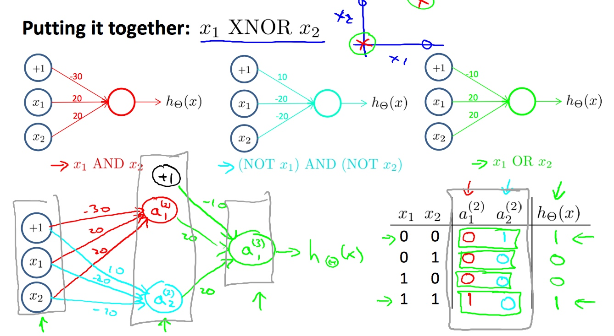
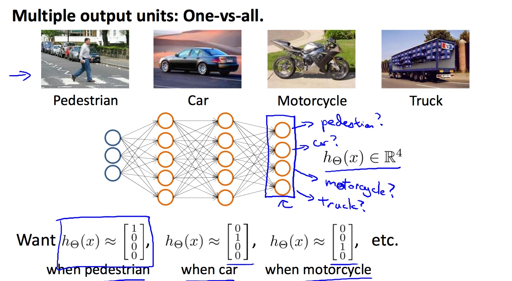
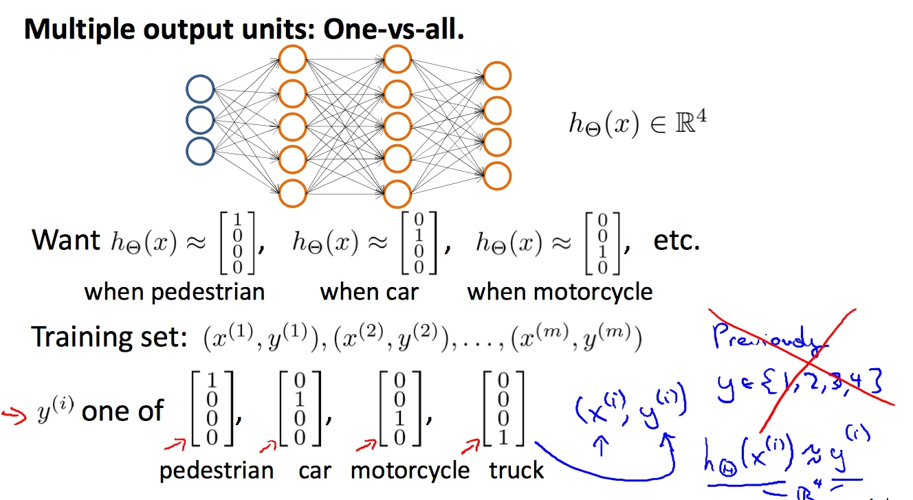

# Week 4 - Neural Networks: Representation

[TOC]

## Model Representation

### Neuron in the brain

* 
    * neurons are basically computational units that take inputs (**dendrites**) as electrical inputs (called "spikes") that are channeled to outputs (**axons**).

### Artificial neural network

#### Neural Model: Logistic unit

* 
* Our **dendrites** are like the **input** features \\(x_1⋯x_n\\),
* The **output** is the result of our hypothesis function.
* \\(x_0\\) input node is called the "**bias unit**", always equal to 1.
* We use the same hypothesis function as in classification: \\(\frac{1}{1+e^{-\Theta^{T}x}}\\).
* Sometimes we call it a sigmoid (logistic) **activation** function.
    * and theta are called "**weights**".
* Input nodes(layer 1) called "**input layer**"
* Another node(layer 2) output the hypothesis function called "**output layer**".

##### Neural Network

* 
* Layers of nodes between the input and output layers called the "**hidden layers**".
* \\(a^{(j)}_{i}\\) = "activation" of unit `i` in layer `j`
* \\(\Theta^{(j)}\\) = matrix of weights controlling function mapping from layer `j` to layer `j+1`

* The values for each of the "activation" nodes is obtained as follows: \\[\begin{aligned} 
    a_1^{(2)} &= g(\Theta_{10}^{(1)}x_0 + \Theta_{11}^{(1)}x_1 + \Theta_{12}^{(1)}x_2 + \Theta_{13}^{(1)}x_3) \\
    a_2^{(2)} &= g(\Theta_{20}^{(1)}x_0 + \Theta_{21}^{(1)}x_1 + \Theta_{22}^{(1)}x_2 + \Theta_{23}^{(1)}x_3) \\
    a_3^{(2)} &= g(\Theta_{30}^{(1)}x_0 + \Theta_{31}^{(1)}x_1 + \Theta_{32}^{(1)}x_2 + \Theta_{33}^{(1)}x_3) \\
    h_\Theta(x) = a_1^{(3)} &= g(\Theta_{10}^{(2)}a_0^{(2)} + \Theta_{11}^{(2)}a_1^{(2)} + \Theta_{12}^{(2)}a_2^{(2)} + \Theta_{13}^{(2)}a_3^{(2)}) \end{aligned}\\]
    * Compute this activation nodes by using a 3×4 matrix of parameters.
    * Each layer gets its own matrix of weights, \\(\Theta^{(j)}\\).
    * If network has \\(s_j\\) units in layer j and \\(s_{j+1}\\) units in layer j+1, then \\(\Theta^{(j)}\\) will be of dimension \\(s_{j+1} \times (s_j+1)\\).
        * The `+1` comes from the addition in \\(\Theta^{(j)}\\) of the "bias nodes", \\(x_0\\) and \\(\Theta^{(j)}_{0}\\).
    * Example: If layer 1 has 2 input nodes and layer 2 has 4 activation nodes. Dimension of \\(\Theta^{(1)}\\) is going to be 4×3 where \\(s_j=2\\) and \\(s_j+1=4\\), so \\(s_{j+1} \times (s_j+1)=4 \times 3\\).
    * Forward propagation: Vectorized implementation
        * Define a new variable \\(z^{(j)}_k\\) to encompass the parameters inside `g` function:
            * \\[\begin{aligned}
                a_1^{(2)} &= g(z_1^{(2)}) \\ 
                a_2^{(2)} &= g(z_2^{(2)}) \\ 
                a_3^{(2)} &= g(z_3^{(2)})
            \end{aligned}\\]
            * In other words, for layer `j=2` and node `k`, the variable `z` will be:
                * \\(z_k^{(2)} = \Theta_{k,0}^{(1)}x_0 + \Theta_{k,1}^{(1)}x_1 + \cdots + \Theta_{k,n}^{(1)}x_n\\)
            * Setting \\(x=a^{(1)}\\), we can rewrite the equation as:
                * \\(z^{(j)} = \Theta^{(j-1)}a^{(j-1)}\\)
            * Then we got:
                * \\(h_\Theta(x) = a^{(j+1)} = g(z^{(j+1)})\\)

## Examples and Intuitions

* A simple example of applying neural networks is by predicting \\(x_1\\) **AND** \\(x_2\\), which is the logical 'and' operator and is only true if both \\(x_1\\) and \\(x_2\\) are **1**.
    * 
        * So we have constructed one of the fundamental operations in computers by using a small neural network rather than using an actual **AND** gate.
* Sample **OR**: 
    * 
* Sample **NOR**: 
    * 
* Sample **XOR**: OR & NOR -> AND
* To represent the **XOR/XNOR** function, will need at least **THREE** layers(one hidden layer).

## Multiclass Classification

* 
* 

