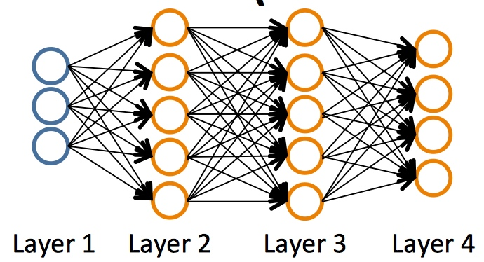
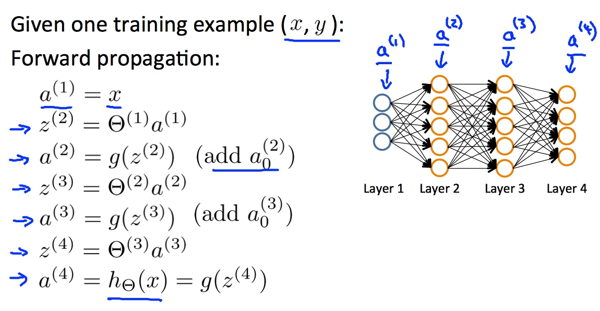
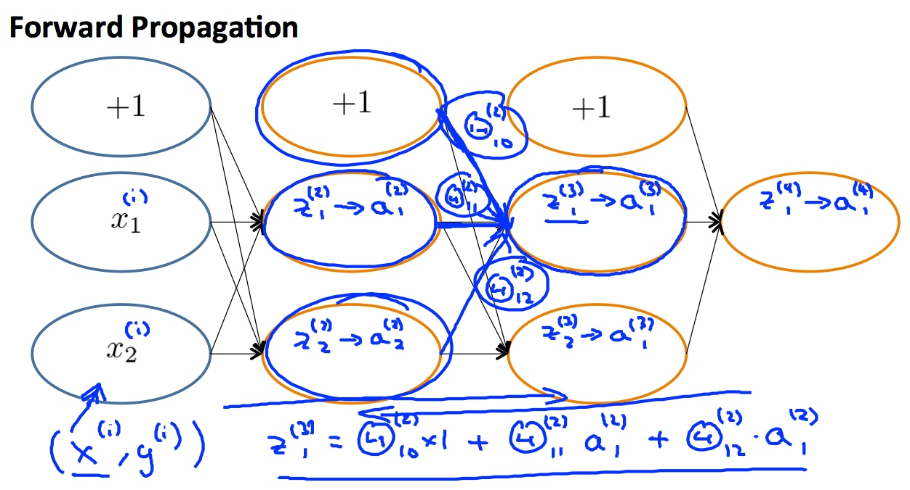
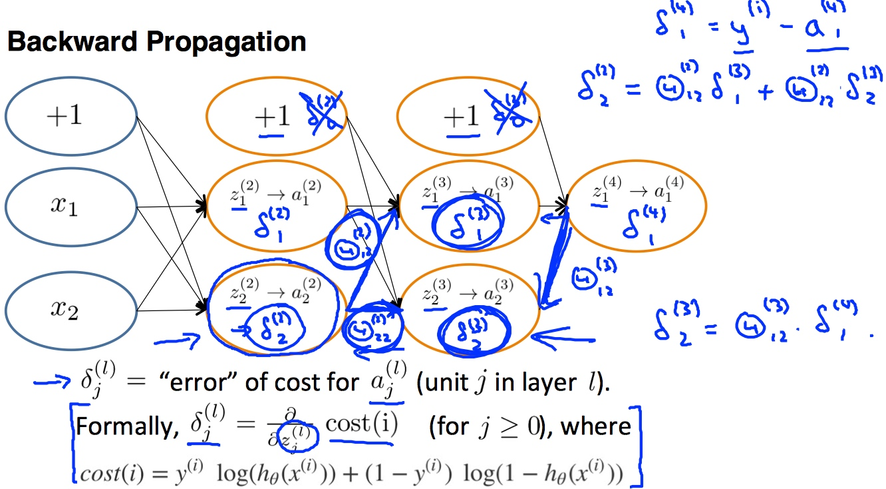

# Week 5 - Neural Networks: Learning

[TOC]

## Cost Function and Back-propagation Algorithm

### Cost Function 

* Let's first define a few variables that we will need to use:
    * \\(L\\) = total number of layers in the network
    * \\(s_l\\) = number of units (not counting bias unit) in layer \\(l\\)
    * \\(K\\) = number of output units/classes
    * For example:
        * 
        * \\(L = 4\\)
        * \\(s_1 = 3, s_2 = 5, s_3 = 5, s_4 = S_L = 4\\)

#### Types of classification problems

* Binary classification
    * 1 output (0 or 1)
    * So, \\(k = 1, s_L = 1\\)
    * \\(h_{\theta}(x) \in \mathbb{R}\\)
* Multi-class classification(K classes)
    * K output units
    * \\(h_{\theta}(x) \in \mathbb{R}^K\\)
    * \\(S_L = K\\)

#### Cost function for neural networks

* The (regularized) logistic regression cost function is as follows: \\[J(\theta) = - \frac{1}{m} \sum_{i=1}^m \large[ y^{(i)}\ \log (h_\theta (x^{(i)})) + (1 - y^{(i)})\ \log (1 - h_\theta(x^{(i)}))\large] + \frac{\lambda}{2m}\sum_{j=1}^n \theta_j^2\\]
* For neural networks, it is: \\[J(\Theta) = - \frac{1}{m} \sum_{i=1}^m \sum_{k=1}^K \left[y^{(i)}_k \log ((h_\Theta (x^{(i)}))_k) + (1 - y^{(i)}_k)\log (1 - (h_\Theta(x^{(i)}))_k)\right] + \frac{\lambda}{2m}\sum_{l=1}^{L-1} \sum_{i=1}^{s_l} \sum_{j=1}^{s_{l+1}} ( \Theta_{j,i}^{(l)})^2\\]
    * Note:
        * the double sum simply adds up the logistic regression costs calculated for each cell in the output layer.
        * the triple sum simply adds up the squares of all the individual Θs in the entire network.
            * Like three loops to fetch all of the Θs
        * the i in the triple sum does **not** refer to training example i

### Backpropagation Algorithm

* The Backpropagation algorithm is used to learn the weights of a multilayer neural network with a fixed architecture. It performs gradient descent to try to minimize the sum squared error between the network’s output values and the given target values. 
* Our goal is to compute: \\[\min_\Theta J(\Theta)\\]. In this section, it is \\[\dfrac{\partial}{\partial \Theta_{i,j}^{(l)}}J(\Theta), (\Theta_{i,j}^{(l)} \in \mathbb{R})\\]

#### The Concepts of Back Propagation and Forward Propagation:
   
* **Forward Propagation**:
    * Takes your neural network and the initial input into that network and pushes the input through the network.
    * It leads to the generation of an output hypothesis, which may be a single real number, or a vector.
* **Back Propagation**:
    * Compare the output to the real value(y) and calculates how wrong the weights were.
    * Then, using the error you've just calculated, back-calculates the error associated with each unit from the preceding layer(i.e. layer L-1) to the input layer.
    * These "error" measurements for each unit can be used to calculate the **partial derivatives**
    * Use the **partial derivatives** with gradient descent to try minimize the cost function and update all the \\(\Theta\\)s.
    * This repeats until gradient descent reports convergence.

#### The Detail of Using Backpropagation to Minimize Partial Derivatives

1. Given training set \\(\lbrace (x^{(1)}, y^{(1)}) \cdots (x^{(m)}, y^{(m)})\rbrace\\)
2. Set \\(\Delta_{ij}^{(l)} = 0 \text{ (for all l,i,j)}\\) . (use to capture \\(\dfrac{\partial}{\partial \Theta_{i,j}^{(l)}}J(\Theta)\\))
3. For training example `i=1` to `m`:
    1. Set \\(a^{(1)} := x^{(t)}\\)
    2. Perform forward propagation to compute \\(a^{(l)} \text{ for l = 2,3,...,L}\\).
        1. 
    3. Using \\(y^{(i)}\\), compute \\(\delta^{(L)} = a^{(L)} - y^{(i)}\\)
        1. `L` is the total number of layers
        2. \\(a^{(L)}\\) is the vector of outputs of the activation units for the last layer.
        3. So our "error values" for the last layer are \\(a^{(L)} - y^{(i)}\\).
    4. Compute \\(\delta^{(L-1)}, \delta^{(L-2)}, \ldots, \delta^{(2)}\\) using \\(\delta^{(l)} = ((\Theta^{(l)})^T \delta^{(l+1)})\ .* \ a^{(l)}\ .* \ (1 - a^{(l)})\\) that steps us back from right to left.
        1. \\((\Theta^{(l)})^T \delta^{(l+1)}\\): has the same dimensionality with \\(a^{(l)}\\).
            * \\((\Theta^{(3)})^T\\): [5 X 4]; \\(\delta^{(4)})\\): [4 X 1], then \\((\Theta^{(3)})^T \delta^{(4)}\\): [5 X 1]
        2. \\(g'(z^{(l)}) = a^{(l)}\ .*\ (1 - a^{(l)})\\): the derivative of the activation function `g` with the input values given by \\(z^{(l)}\\).
        3. There will be no \\(\delta^{(1)}\\), cause the first layer corresponds to the input layer.
    5. \\(\Delta^{(l)}_{i,j} := \Delta^{(l)}_{i,j} + a_j^{(l)} \delta_i^{(l+1)}\\) or with vectorization, \\(\Delta^{(l)} := \Delta^{(l)} + \delta^{(l+1)}(a^{(l)})^T\\)
        1. Note this: 
            1. `i` is the error of the affected node of layer `l`. 
            2. `j` is the node of layer `l`.  
            3. the number of nodes(`m`) in layer `l` equals the number of the errors of the affected(`n`) in layer `l+1`.
            4. and \\(\delta^{(l+1)}(a^{(l)})^T\\) will be a `m*n` matrix, same as \\(\Theta^{(l)}\\).
            5. * **// TODO** why this \\(a_j^{(l)} \delta_i^{(l+1)}\\) is partial derivative?
4. Hence we update our new \\(\Delta\\) matrix.
    * \\(D^{(l)}_{i,j} := \dfrac{1}{m}\left(\Delta^{(l)}_{i,j} + \lambda\Theta^{(l)}_{i,j}\right)\\), if \\(j \ne 0\\).
    * \\(D^{(l)}_{i,j} := \dfrac{1}{m}\Delta^{(l)}_{i,j}\\), if \\(j = 0\\).
5. The capital-delta matrix `D` is used as an "accumulator" to add up our values as we go along and eventually compute our partial derivative. Thus we get \\(\frac \partial {\partial \Theta_{ij}^{(l)}} J(\Theta) = D^{(l)}_{i,j}\\)

### Backpropagation intuition

* The detail of forward propagation:
    * 
* Recall that the cost function for a neural network. If we consider simple non-multiclass classification (k=1) and disregard regularization, the cost is computed with: \\[cost(t) =y^{(t)} \ \log (h_\Theta (x^{(t)})) + (1 - y^{(t)})\ \log (1 - h_\Theta(x^{(t)}))\\]
* Intuitively, \\(\delta_j^{(l)}\\) is the "error" for \\(a_j^{(l)}\\) (unit `j` in layer `l`). More formally, the delta values are actually the derivative of the cost function: \\[\delta_j^{(l)}=\frac{d}{dz_j^{(l)}}cost(t)\\]
* Recall that our derivative is the slope of a line tangent to the cost function, so the steeper the slope the more incorrect we are. Let us consider the following neural network below and see how we could calculate some \\(\delta_j^{(l)}\\) :
    * 
    * To calculate every single possible \\(\delta_j^{(l)}\\), we could start from the right of our diagram. We can think of our edges as our \\(\Theta_{ij}\\). Going from right to left, to calculate the value of \\(\delta_j^{(l)}\\), you can just take the over all sum of each weight times the \\(\delta\\) it is coming from. For example: \\[\begin{aligned}\delta_2^{(3)} &= \Theta_{12}^{(3)} * \delta_1^{(4)} \\ \delta_2^{(2)} &= \Theta_{12}^{(2)} * \delta_1^{(3)} + \Theta_{22}^{(2)} * \delta_2^{(3)} \end{aligned}\\].

## Refers

* [http://www.holehouse.org/mlclass/09_Neural_Networks_Learning.html](http://www.holehouse.org/mlclass/09_Neural_Networks_Learning.html)
* [Derivation of Backpropagation(PDF)](files/BackPropDeriv.pdf)

