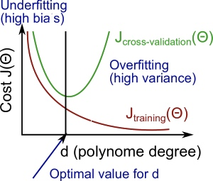
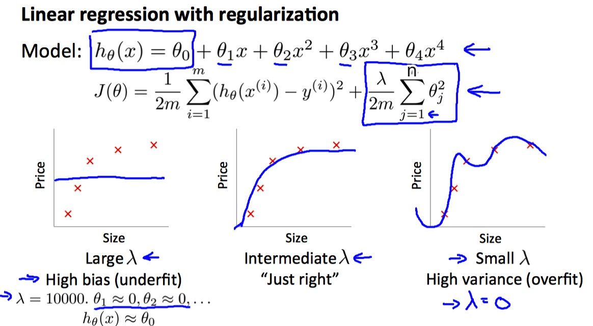
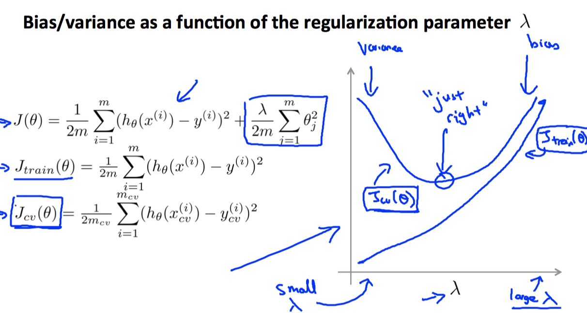
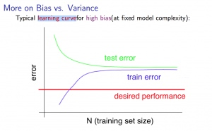
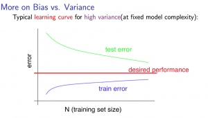

# Week 6a - Advice for Applying Machine Learning

[TOC]

## Evaluating a Learning Algorithm

### Debugging a learning algorithm

* There are many things you can try if the learning algorithm doesn't work well:
    * Get more training examples
        * Sometimes more data doesn't help
        * Often it does though, although you should always do some preliminary testing to make sure more data will actually make a difference
    * Try smaller sets of features
        * Carefully select small subset
        * You can do this by hand, or use some dimensionality reduction technique
    * Try getting additional features
        * Sometimes this isn't helpful 
        * Can be very time consuming
    * Try adding polynomial features (\\(x_1^2, x_2^2, x_1x_2, \text{etc.}\\))
    * Try decreasing or increasing λ
        * Change how important the regularization term is in your calculations
    
### Evaluate a Hypothesis

* Split up the data into two sets: a **training set** and a **test set**. Typically, the training set consists of **70 %** of your data and the test set is the remaining **30 %**.
* The new procedure using these two sets is then:
    1. Learn \\(\Theta\\) and minimize \\(J_{train}(\Theta)\\) using the training set
    2. Compute the test set error \\(J_{train}(\Theta)\\)

#### The test set error

* For linear regression: \\[J_{test}(\Theta) = \dfrac{1}{2m_{test}} \sum_{i=1}^{m_{test}}(h_\Theta(x^{(i)}_{test}) - y^{(i)}_{test})^2\\]
* For classification ~ Misclassification error (aka 0/1 misclassification error): \\[err(h_\Theta(x),y) = \begin{matrix} 1 & \text{if } h_\Theta(x) \geq 0.5\ and\ y = 0\ or\ h_\Theta(x) < 0.5\ and\ y = 1\\ 0 & \text{ otherwise }\end{matrix}\\] 
* This gives us a binary 0 or 1 error result based on a misclassification. The average test error for the test set is: \\[\text{Test Error} = \dfrac{1}{m_{test}} \sum^{m_{test}}_{i=1} err(h_\Theta(x^{(i)}_{test}), y^{(i)}_{test})\\]
* This gives us the proportion of the test data that was misclassified.

### Model Selection and Train/Validation/Test Sets

* Last time, we split up the data to two sets (70/30). And we used the test sets to choose the best hypothesis(i.e. specifically chose it because the test set error is small), then the hypothesis will gave us the best possible performance on the test set. 
* The problem is, the best model is likely to be an overly optimistic estimate of generalization error. Because we had fit this hypothesis to the test set, which is no longer fair to evaluate it on the test set. So there is another way:
    * Break down the dataset into three sets:
        * Training set: 60%
        * Cross validation set: 20%
        * Test set: 20%
* We can now calculate three separate error values for the three different sets using the following method:
    1. Optimize the parameters in \\(\Theta\\) using the training set for each polynomial degree.
    2. Find the polynomial degree **d** with the least error using the cross validation set.
    3. Estimate the generalization error using the test set with \\(J_{test}(\Theta^{(d)})\\), (d = theta from polynomial with lower error);
* This way, the degree of the polynomial **d** has not been trained using the test set.

## Bias vs. Variance

### Diagnosing Bias vs. Variance

* In this section we examine the relationship between the degree of the polynomial d and the underfitting or overfitting of our hypothesis.
    * We need to distinguish whether **bias** or **variance** is the problem contributing to bad predictions.
    * High bias is underfitting and high variance is overfitting. Ideally, we need to find a golden mean between these two.
* The training error will tend to **decrease** as we increase the degree d of the polynomial.
* At the same time, the cross validation error will tend to **decrease** as we increase d up to a point, and then it will **increase** as d is increased, forming a convex curve.
* **High bias(underfitting): both \\(J_{train}(\Theta)\\) and \\(J_{CV}(\Theta)\\) will be high. Also, \\(J_{CV}(\Theta) \approx J_{train}(\Theta)\\).
* **High variance(overfitting)**: \\(J_{train}(\Theta)\\) will be low and \\(J_{CV}(\Theta)\\) will be much greater than \\(J_{train}(\Theta)\\).
* The is summarized in the figure below:
    * 

### Regularization and Bias/Variance

* 
* In the figure above, we see that as λ increases, our fit becomes more rigid. On the other hand, as λ approaches 0, we tend to over overfit the data. So how do we choose our parameter λ to get it 'just right' ? In order to choose the model and the regularization term λ, we need to:
    * Create a list of lambdas (i.e. λ∈{0,0.01,0.02,0.04,0.08,0.16,0.32,0.64,1.28,2.56,5.12,10.24});
    * Create a set of models with different degrees or any other variants.
    * Iterate through the λs and for each λ go through all the models to learn some Θ.
    * Compute the cross validation error using the learned Θ (computed with λ) on the \\(J_{CV}(\Theta)\\) **without** regularization or λ = 0.
    * Select the best combo that produces the lowest error on the cross validation set.
    * Using the best combo Θ and λ, apply it on \\(J_{test}(\Theta)\\) to see if it has a good generalization of the problem.
* 

### Learning Curves

* Training an algorithm on a very few number of data points (such as 1, 2 or 3) will easily have 0 errors because we can always find a quadratic curve that touches exactly those number of points. Hence:

    * As the training set gets larger, the error for a quadratic function increases.
    * The error value will plateau out after a certain m, or training set size.

* **Experiencing high bias:**

    * **Low training set size**: causes \\(J_{train}(\Theta)\\) to be low and \\(J_{CV}(\Theta)\\) to be high.
    * **Large training set size**: causes both \\(J_{train}(\Theta)\\) and \\(J_{CV}(\Theta)\\) to be high with \\(J_{CV}(\Theta) \approx J_{train}(\Theta)\\).
    * If a learning algorithm is suffering from **high bias**, getting more training data will not (**by itself**) help much.
    * 

* **Experiencing high variance:**
    
    * **Low training set size**: \\(J_{train}(\Theta)\\) will be low and \\(J_{CV}(\Theta)\\) will be high.
    * **Large training set size**: \\(J_{train}(\Theta)\\) increases with training set size and \\(J_{CV}(\Theta)\\) continues to decrease without leveling off. Also, \\(J_{train}(\Theta) < J_{CV}(\Theta)\\) but the difference between them remains significant.
    * If a learning algorithm is suffering from **high variance**, getting more training data is likely to help.
    *   

### Deciding What to Do Next Revisited

* Our decision process can be broken down as follows:

    * **Getting more training examples**: Fixes high variance
    * **Trying smaller sets of features**: Fixes high variance
    * **Adding features**: Fixes high bias
    * **Adding polynomial features**: Fixes high bias
    * **Decreasing λ**: Fixes high bias
    * **Increasing λ**: Fixes high variance.
    
#### Diagnosing Neural Networks

* A neural network with fewer parameters is **prone to underfitting**. It is also **computationally cheaper**.
* A large neural network with more parameters is **prone to overfitting**. It is also **computationally expensive**. In this case you can use regularization (increase λ) to address the overfitting.

* Using a single hidden layer is a good starting default. You can train your neural network on a number of hidden layers using your cross validation set. You can then select the one that performs best.

* **Model Complexity Effects**:

    * Lower-order polynomials (low model complexity) have high bias and low variance. In this case, the model fits poorly consistently.
    * Higher-order polynomials (high model complexity) fit the training data extremely well and the test data extremely poorly. These have low bias on the training data, but very high variance.
    * In reality, we would want to choose a model somewhere in between, that can generalize well but also fits the data reasonably well.

