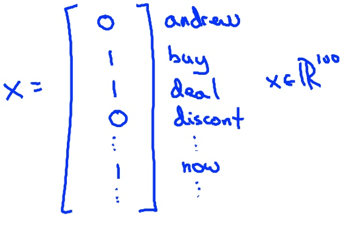
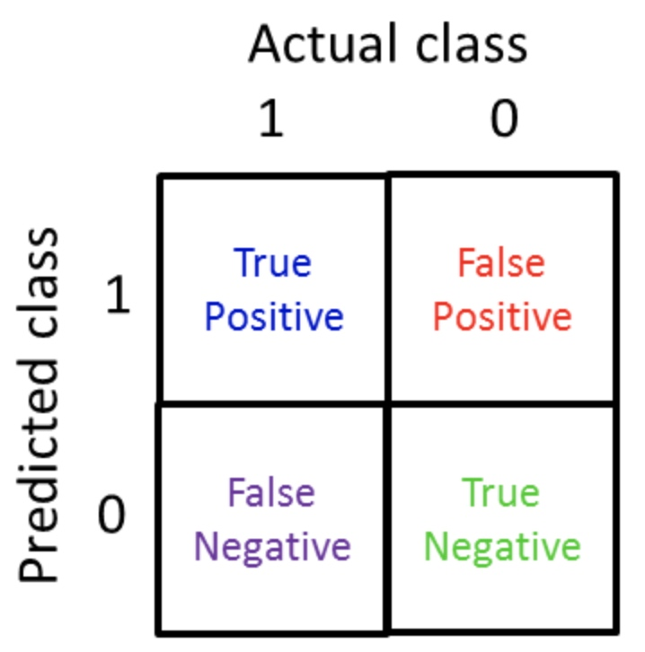
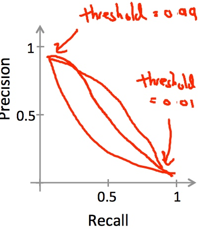
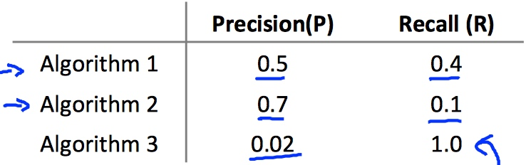

# Week 6b - Machine Learning System Design

[TOC]

## Prioritizing What to Work On

### Spam Classification Example

* First, choose features, like email header, content, sender, etc.
* One approach is, choose 100 words indicative of spam/not spam as features **x**. And set y = spam(1) or not spam(0).
    * Spam --> e.g. buy, discount, deal
    * Not Spam --> Andrew, now
* Define a feature vector **x** which is 0 or 1 if a word corresponding to spam/not spam.
    * 
    * In practice, take most frequently occurring \\(n\\) words (10,000 to 50,000) in training set, rather than 100 words.
* Next thing is, how to improve system accuracy ?
    * Collect lots of data
        ‐ E.g. “honeypot” project.
    * Develop sophisticated features based on email routing information (from email header).
    * Develop sophisticated features for message body, e.g. should “discount” and “discounts” be treated as the same word? How about “deal” and “Dealer”? Features about punctuation?
    * Develop sophisticated algorithm to detect misspellings (e.g. m0rtgage, med1cine, w4tches.)

### Error Analysis

* If you're starting work on a machine learning problem, it's often considered very good practice to start by building a very simple algorithm that you can implement quickly.

* Recommended Approach
    * Start with a simple algorithm that you can implement quickly. Implement it and test it on your cross-validation data.
    * Plot learning curves to decide if more data, more features, etc. are likely to help.
    * Error analysis: Manually examine the examples (in cross validation set) that your algorithm made errors on. See if you spot any systematic trend in what type of examples it is making errors on.

* Manually examine the samples (in cross validation set) that your algorithm made errors on, to see if you can work out why.
    * e.g.
        * Built a spam classifier with 500 examples in CV set, and error rate is high - gets 100 wrong
        * Manually look at these 100 errors and categorize them depending on features
        * Find the most **common type** of spam emails are pharmacy emails and phishing emails
        * And try some new features may help us to classify them correctly.
            * e.g. deliberate misspelling
            * Unusual email routing
            * Unusual punctuation
* The importance of numerical evaluation
    * to do some A/B tests, like, with/without stemming; distinguish upper/lower case or not, etc.

### Error Metrics for Skewed Classes

#### Skewed Classes(偏斜类)

* Let's take an example:
* Cancer classification:
    * Train logistic regression model \\(h_{\theta}(x).(y = 1 if cancer, y = 0 otherwise)
    * Find that you got 1% error on test set. (99% correct diagnoses)
    * But the truth is, only 0.50% of patients have cancer.
    * It means if we write a fake function, which always return 0, will have 99.50% accuracy.
    * And this is an example of **skewed classes**.
        * When the ratio of positive to negative examples is very close to one of two extremes, because y equals one so rarely.

#### Precision and Recall (精确度和召回率)

* 
* **Precision**: Of all patients we predicted have cancer, what fraction of them actually have cancer.
    * = true positives / # predicted positive
    * = true positives / (true positive + false positive)
* **Recall**: Of all patients in set that actually have cancer, what fraction did we correctly detect
    * = true positives / # actual positives
    * = true positive / (true positive + false negative)

#### Trading Off Precision and Recall(精确度和召回率的权衡)

* Before we set **0.5** as the threshold of the logistic regression for classification, then:
    * Predict 1 if \\(h_{\theta}(x) \ge 0.5\\)
    * Predict 0 if \\(h_{\theta}(x) < 0.5\\)
* To predict **y = 1**(cancer) only if very confident
    * One way is change the threshold to **0.8**, then:
        * Predict 1 if \\(h_{\theta}(x) \ge 0.8\\)
        * Predict 0 if \\(h_{\theta}(x) < 0.2\\)
    * Now we can be more confident that 1 is a true positive
    * But also the classifier has lower recall - predict y = 1 for a smaller number of patients
        * Risk of false negatives
* Avoid false negatives (avoid missing too many cases of cancer)
    * This is probably worse for the cancer example
    * Set a lower threshold
        * Predict 1 if \\(h_{\theta}(x) \ge 0.3\\)
        * Predict 0 if \\(h_{\theta}(x) < 0.7\\)
    * So now we have have a higher recall, but lower precision
        * Risk of false positives, because we're less discriminating in deciding what means the person has cancer
* plotting precision vs. recall:
    * 
* Is there a way to automatically choose the threshold? Or how to decide which algorithms is best for us?
    * Can we just average the sum of Precision and Recall?
* For example: 
    * 
* If we use average(\\(\frac{P+R}{2}\\)), the **Algorithm 3** will be best one. But it almost predict **y = 1** all the time.
* The better ways is to use \\(F_1\\)**Score (F score)** \\(= 2\frac{PR}{P+R}\\) (P: Precision, R: Recall)
    * Then the best choice is **Algorithm 1**.
* **Fscore** gives a single real number evaluation metric
    * If you're trying to automatically set the threshold, one way is:
        * Try a range of threshold values and evaluate them on your cross validation set.
        * Then pick the threshold which gives the best fscore.

### Data For Machine Learning

* How the data helps us to design a high accuracy learning system:
    * more parameters --> low bias
    * more training data --> low variance
* If we want a high performance learning algorithm, two questions should be asked:
    * can a human experts look at the features **x** and confidently predict the value of **y**.
    * can we actually get **a large training set**, and train the learning algorithm with **a lot of parameters** in the training set.

