# Week 7 - Support Vector Machines(SVM)

[TOC]

* Compared to both logistic regression and neural networks, **SVM** sometimes gives a cleaner way of learning non-linear functions

## Optimization Objective

* Start with logistic regression, and modify it a bit to get the SVM.
* The logistic regression hypothesis is: \\[h_{\theta}(x) = \frac{1}{1+e^{-\theta^{T}x}}\\]
* And the sigmoid activation function looks like: 
    * 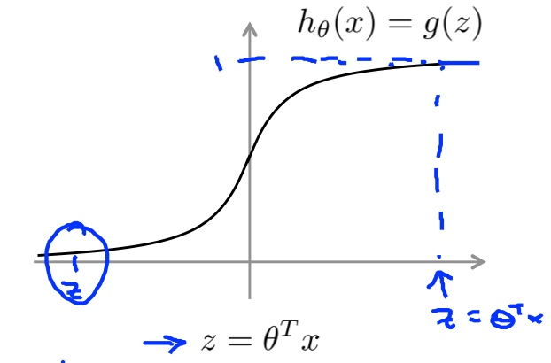
* If \\(y = 1\\), we want \\(h_{\theta}(x) \approx 1\\), \\(\theta^{T}x \gg  0\\)
* If \\(y = 0\\), we want \\(h_{\theta}(x) \approx 0\\), \\(\theta^{T}x \ll  0\\)
* Cost of single example: \\[-(y\log{h_{\theta}(x)} + (1 - y)\log{(1 - h_{\theta}(x)})) \\ = -(y\log{\frac{1}{1+e^{-\theta^{T}x}}} - (1 - y)\log{(1 - \frac{1}{1+e^{-\theta^{T}x}}}))\\]
* If \\(y = 1\\) (want \\(\theta^Tx \gg 0\\)), then the cost will be: \\(-\log\dfrac{1}{1+e^{-z}}\\)
    * 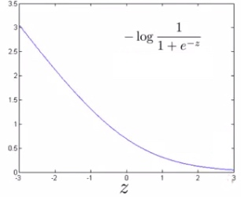
* If \\(y = 0\\) (want \\(\theta^Tx \ll 0\\)), then the cost will be: \\(-\log{(1 - \dfrac{1}{1+e^{-z}}})\\)
    * 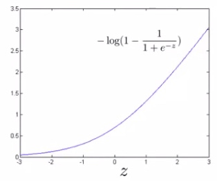
* To build SVM, we redefine the cost functions:
    * If \\(y = 1\\):
        * 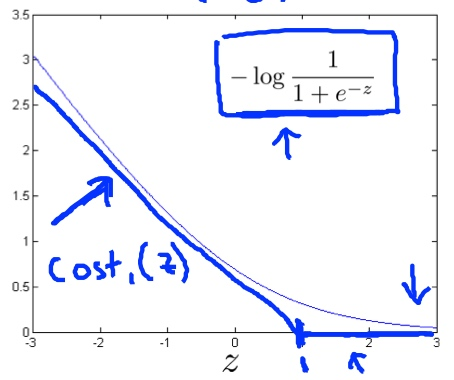
        * Instead of a curve line, we create two straight lines which acts as an approximation to the logistic regression.
        * We call this function \\(cost_1(z)\\).
    * If \\(y = 0\\):
        * 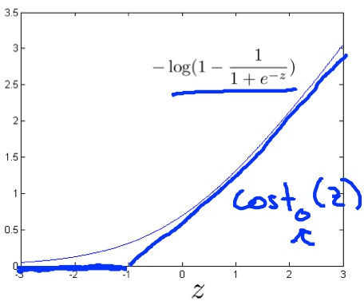
        * We call this function \\(cost_0(z)\\).
* **The complete SVM cost function**
    * As a comparison we have logistic regression: \\[{\text{min}\atop{\theta}} \ - \frac{1}{m} \sum_{i=1}^m \large[ y^{(i)}\ \log (h_\theta (x^{(i)})) + (1 - y^{(i)})\ \log (1 - h_\theta(x^{(i)}))\large] + \frac{\lambda}{2m}\sum_{j=1}^n \theta_j^2\\]
    * Replace the cost function with \\(cost_0(z)\\) and \\(cost_1(z)\\), we get: \\[{\text{min}\atop{\theta}}\ \frac{1}{m} \sum_{i=1}^m \large[ y^{(i)}\ cost_1(\theta^Tx^{(i)}) + (1 - y^{(i)})\ cost_0(\theta^Tx^{(i)})\large] + \frac{\lambda}{2m}\sum_{j=1}^n \theta_j^2\\]
    * In convention with SVM notation, we adjust a little bit: 
        * Get rid of \\(\dfrac{1}{m}\\) term.
            * Because \\(\frac{1}{m}\\) is a constant, so we should still end up with the same optimal value for \\(theta\\).
        * For logistic regression we have:
            * Training data set term **A**: \\[- \frac{1}{m} \sum_{i=1}^m \large[ y^{(i)}\ \log (h_\theta (x^{(i)})) + (1 - y^{(i)})\ \log (1 - h_\theta(x^{(i)}))\large]\\]
            * and Regularization term **B**: \\[\frac{\lambda}{2m}\sum_{j=1}^n \theta_j^2\\]
            * To conclude it, we get \\(A + \lambda B \\)
            * So \\(\lambda\\) is the trade-off between training data set and regularization terms.
            * Instead of using \\(A + \lambda B \\), In SVM, we rewrite it as \\(CA + B\\), which **C** is a constant.
            * We can think of the parameter **C** playing a role similar to \\(\frac{1}{\lambda}\\).
    * Overall optimization objective function for the SVM is: \\[{\text{min}\atop{\theta}}\ C \sum_{i=1}^m \large[ y^{(i)}\ cost_1(\theta^Tx^{(i)}) + (1 - y^{(i)})\ cost_0(\theta^Tx^{(i)})\large] + \frac{1}{2}\sum_{j=1}^n \theta_j^2\\]
* SVM Hypothesis: 
    * Unlike logistic, \\(h_{\theta}(x)\\) doesn't give us a probability, instead we get a direct prediction of **1** or **0**
    * \\[h_{\theta}(x) = \left\{ \begin{array}{rl} 
        1 & \text{, if } \theta^Tx \ge 0 \\ 
        0 & \text{, } otherwise. 
        \end{array} \right.\\]

## Large Margin Intuition

* Sometimes SVM called **Large Margin Classifier**. 
* Here are two plots for the cost function:
    * 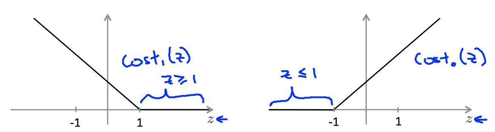
* If we want the cost to be small, then we will need \\(z\\) to be more that **1** not just **0**. then:
    * If \\(y = 1\\), we want \\(\theta^Tx \ge 1\\) (not just \\( \ge 0\\).
    * If \\(y = 0\\), we want \\(\theta^Tx \le -1\\) (not just \\( \le 0\\).

### SVM Decision Boundary

* Use the simplified cost function \\(min_{\theta} = CA+B\\)
* If **C** is a huge number, like **100,000**, then we will need to make **A** to be very small, best to be 0, and in the same time minimize **B**.
    * Whenever \\(y^{(i)} = 1\\): \\(\theta^Tx^{(i)} \ge 1\\).
    * Whenever \\(y^{(i)} = 0\\): \\(\theta^Tx^{(i)} \le -1\\).
    * \\({\text{min}\atop{\theta}}\ \dfrac{1}{2}\sum_{i=1}^n\theta_j^2\\)
* Let's check the result in a **linearly separable case**
    * 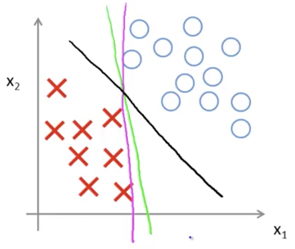
    * The green and magenta lines are functional decision boundaries which could be chosen by logistic regression
    * The black line, by contrast is the the chosen by the SVM because of this safety net imposed by the optimization graph
    * We can see that, there is a large margin between the black line and the training sets  which is called **the margin of the support vector machine**.
        * 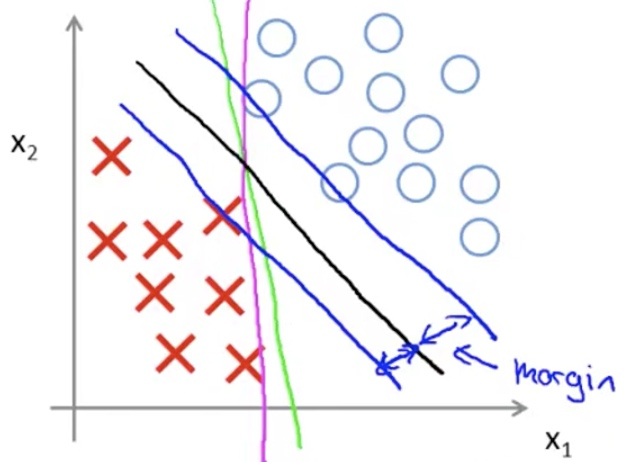
    * In another situation:
        *  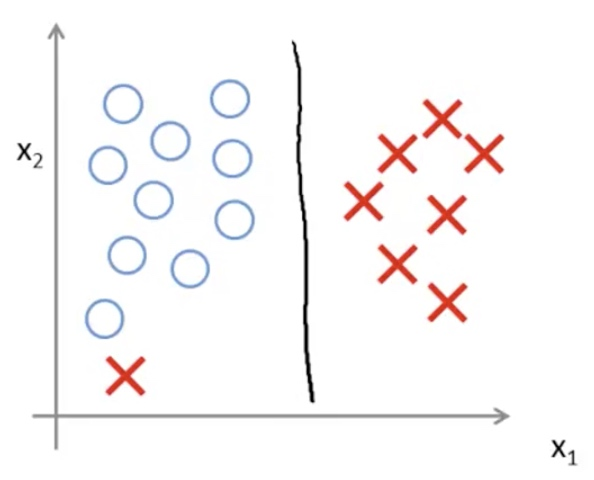
        *  We can't get the result like the black line, since we set **A** to **0**, so the SVM is very sensitive to outliers. And we probably will get the magenta line below. Which lead to another way to fix this: set **C** to a small number, which means ignoring some outliers.
            * 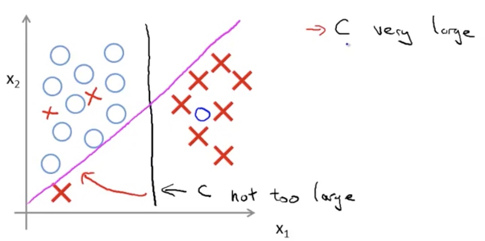

## Mathematics Behind Large Margin Classification

### Vector Inter Productions

* 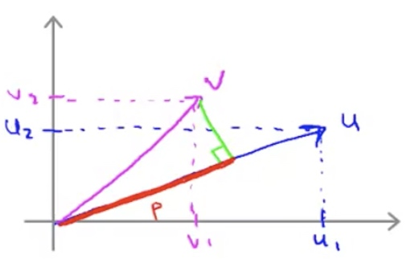
* \\(u = \begin{bmatrix} u_1 \\ u_2 \end{bmatrix}\\), \\(v = \begin{bmatrix} v_1 \\ v_2 \end{bmatrix}\\)
* length of vector: \\(\lVert u \rVert = \sqrt{u_0^2+u_1^2}\\)
* **p** = length of projection of **v** onto **u**.
    * **p** is signed, which means it can be negative number.
* \\(\begin{aligned}u^tv &= p \cdot \lVert u \rVert \\ &= u_1v_1 + u_2v_2 \end{aligned}\\)

### SVM Decision Boundary

* \\({\text{min}\atop{\theta}}\ \dfrac{1}{2}\sum_{i=1}^n\theta_j^2\\)
* \\(\begin{aligned}\text{s.t. } \theta^Tx^{(i)} &\ge 1\ \text{ if }y^{(i)} = 1 \\ \theta^Tx^{(i)} &\le -1\ \text{ if } y^{(i)} = 0\end{aligned}\\)
* **Simplification**: set \\(\theta_0 = 0\text{, }n = 2\\)(only 2 features). Then: 
    * \\({\text{min}\atop{\theta}}\ \dfrac{1}{2}\sum_{i=1}^n\theta_j^2 = \frac{1}{2}(\theta_1^2+\theta_2^2) = \frac{1}{2}(\sqrt{\theta_1^2+\theta_2^2})^2 = \frac{1}{2}{\lVert \theta \rVert}^2\\)
    * \\(\theta^Tx^{(i)} = p^{(i)} \cdot {\lVert \theta \rVert} = \theta_1x_1^{(i)} + \theta_2x_2^{(i)}\\)
        * 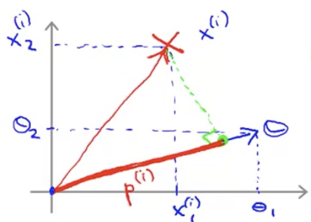
    * Redefine these functions, we get:
        * \\(\begin{aligned}\text{s.t. } p^{(i)} \cdot {\lVert \theta \rVert} &\ge 1\ \text{ if }y^{(i)} = 1 \\ p^{(i)} \cdot {\lVert \theta \rVert} &\le -1\ \text{ if } y^{(i)} = 0\end{aligned}\\)
        * where \\(\\p^{(i)}\\) is the projection of \\(x^{(i)}\\) onto the vector \\(\theta\\).
    * Note that, \\(\theta_0 = 0\\), so  the boundary has to pass through the origin (0,0).
    * Let's consider the training examples like this:
        * 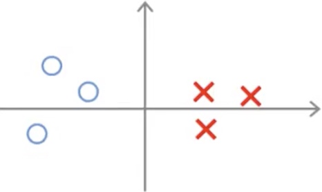
    * And draw an option, to see if it's possible that SVM would choose.
        * 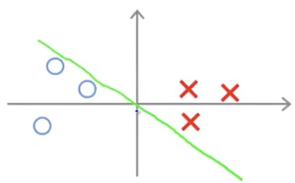
        * Note that **θ is always at 90 degrees to the decision boundary** (check linear algebra to find out why).
        * So vector \\(\theta\\) should be:
            * 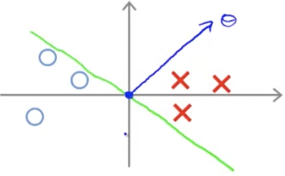
        * Then we can find the projection \\(p^{(i)}\\) of \\(x^{(i)}\\) onto \\(\theta\\):
            * 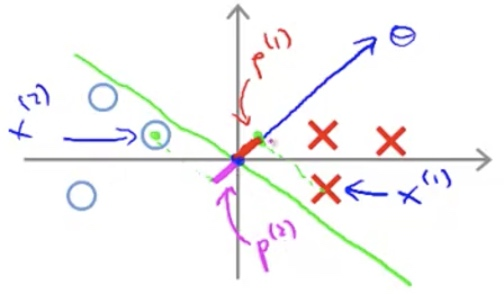
            * We know that we need to make \\(p^{(i)} \cdot {\lVert \theta \rVert} \ge 1\\), so: 
                * if **p** is small, then \\({\lVert \theta \rVert}\\) should be very large
            * Similarly, for the negative examples.
        * But the optimization objective is trying to find a set of parameters where the norm of theta is small. So this doesn't seem like a good choice.
    * Let's another option:
        * 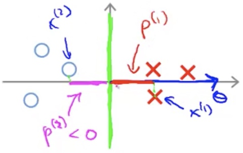
        * Now if you look at the projection \\(p^{(i)}\\) of \\(x^{(i)}\\) onto \\(\theta\\), we find that **p** becomes large and \\({\lVert \theta \rVert}\\) can be small.
        * This is why the SVM choses this hypothesis as the better one, and how we generate the large margin.
        * 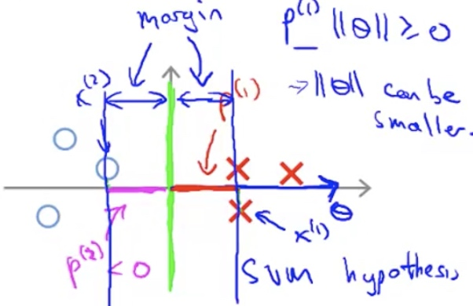
* Finally, we did this derivation assuming \\(\theta_0 = 0\\). 
    * It just means we are entertaining decision boundaries that pass through the origins of decision boundaries pass through the origin (0,0). 
    * If you allow \\(\theta_0\\) to be other values then this simply means you can have decision boundaries which cross through the x and y values at points other than (0,0).

## Kernels I

* Kernels is used to adapt support vector machines in order to develop complex nonlinear classifiers. 
* Let's see a example(find a non-linear boundary):
    * 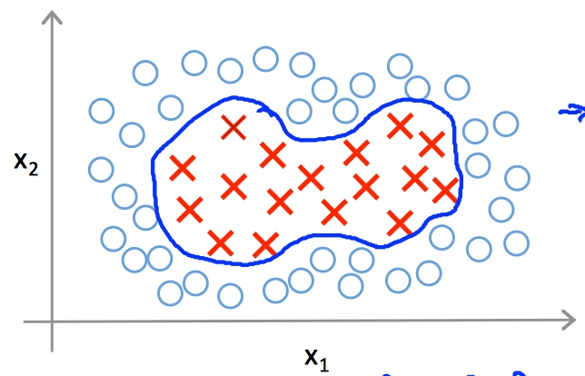
    * One way to distinguish the positive and negative examples is to come up with a set of complex polynomial features: \\[h_{\theta}(x) = \left\{ \begin{array}{rl} 
        1 & \text{, if }\ \theta_0 + \theta_1 x_1 + \theta_2 x_2 + \theta_3 x_1 x_2 + \theta_4 x_1^2 + \theta_5 x_2^2 + \cdots \ge 0 \\ 
        0 & \text{, } otherwise. 
        \end{array} \right.\\] 
    * Another way is using a new notation to denote \\(x_1, x_2, x_1 x_2, x_1^2, x_2^2\\) as \\(f_1, f_2, f_3, f_4, f_5, \cdots\\), so the hypothesis will be: \\[h_{\theta}(x) = \left\{ \begin{array}{rl} 
        1 & \text{, if }\ \theta_0 + \theta_1 f_1 + \theta_2 f_2 + \theta_3 f_3 + \theta_4 f_4 + \theta_5 f_5 + \cdots \ge 0 \\ 
        0 & \text{, } otherwise. 
        \end{array} \right.\\] 
    * Is there a different/better choice of the features \\(f_1, f_2, f_3, \cdots\\) ?

### Create New Features

* First, manually pick a few points. In this case, we picked three points, and call them **landmarks** (\\(l^{(1)}, l^{(2)}, l^{(3)}\\)).
    * 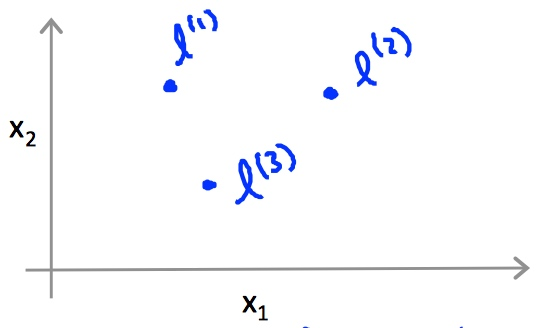
    * Later, will explain how to choose \\(l^{(i)}\\)
* Second, define \\(f_1, f_2, f_3\\) as the similarity between \\(x\\) and \\(l^{(i)}\\)(ignore \\(x_0\\)). Then: \\[\begin{aligned}
    f_1 &= \text{similarity}(x, l^{(1)}) = \text{exp}(-\frac{{\lVert x - l^{(1)} \rVert}^2}{2\sigma^2}) \\
    f_2 &= \text{similarity}(x, l^{(2)}) = \text{exp}(-\frac{{\lVert x - l^{(2)} \rVert}^2}{2\sigma^2}) \\
    &\vdots \\
    \end{aligned}\\]
    * This similarity function is called a **Kernel**. And this **exp** function is a **Gaussian Kernel**.
    * So, instead of writing similarity between x and l we might write \\[f_1 = k(x, l^{(1)})\\]

