# Week 8 - Unsupervised Learning & Dimensionality Reduction

[TOC]

## Unsupervised Learning

### Clustering

* Check [Computational Thinking(Lecture 12)](https://cs.ericyy.me/computational-thinking/lecture-12.html#clustering) for the **clustering** and **k-means algorithm** notes.
* 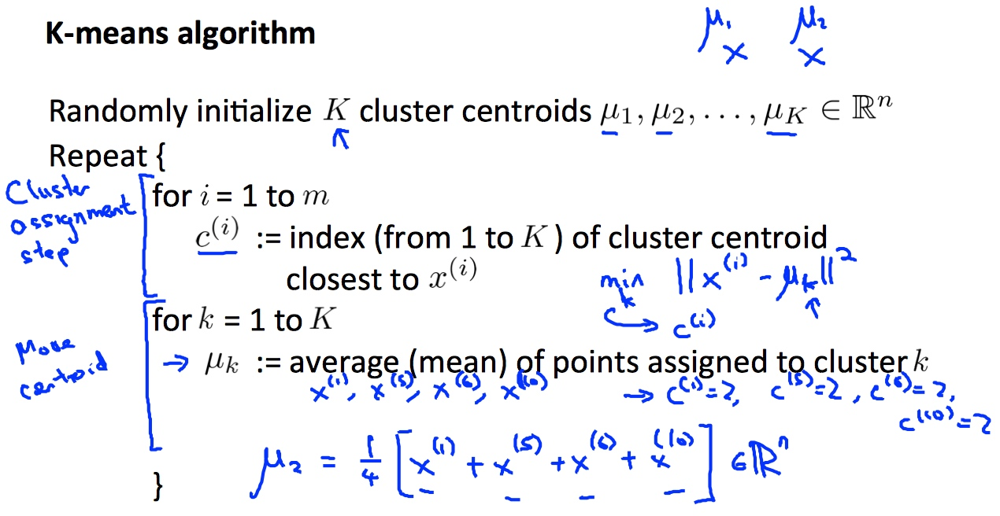

#### Optimization Objective

* Cost Function: \\[J(c^{(1)}), \ldots, c^{(m)}, \mu_{1}, \ldots, \mu_{k}) = \frac{1}{m}\sum_{i=1}^{m} \lVert x^{(i)} - \mu_{c^{(i)}} \rVert^2\\]
    * \\(c^{(i)}\\) = index of cluster(1,2,...,K) to which exampe \\(x^{(i)}\\) is currently assigned.
    * \\(\mu_{k}\\) = cluster centroid \\(k\\) (\\(\mu_k \in \mathbb{R}^n\\))
* a little explanation about the **k-means algorithm** 
    * cluster assigned step: minimize \\(J(\ldots)\\)
    * move centroid step: choose \\(\mu\\) which minimized \\(J(\ldots)\\)

#### Random Initialization

* \\(K < m\\)
* Randomly pick **K** training examples
* Set \\(\mu_1, \ldots, \mu_K\\) equal to these **K** examples.
     
* How to fix **Local Optima**
    * the situation like:
        * 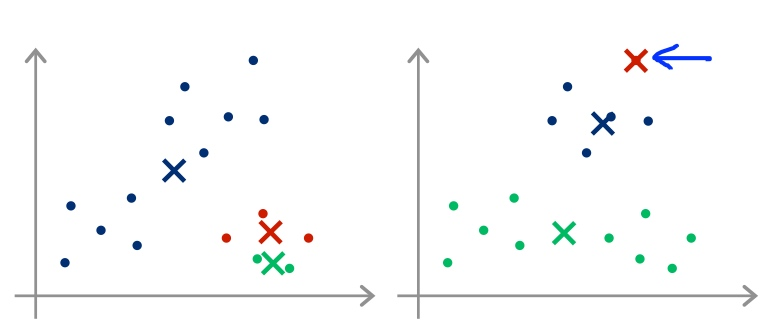
    * The solution is: Try multiple times of random initialization.
    * 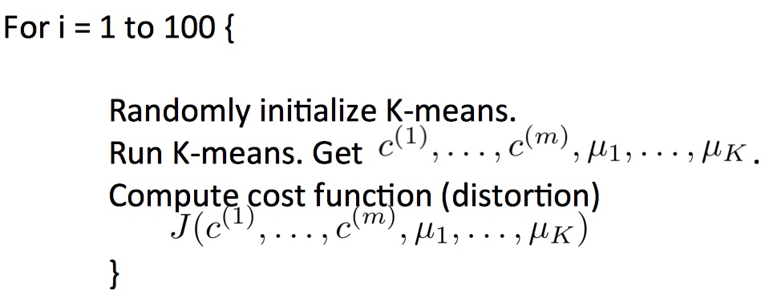
     
####  Choosing the Number of Clusters
    
* First method is to use **Elbow method**: 
    * 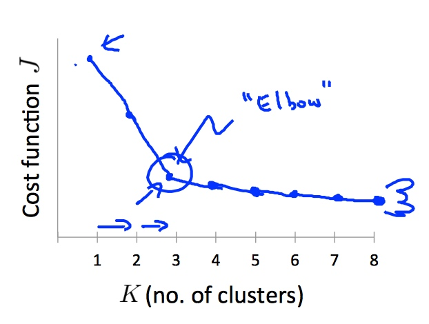
    * Sometimes, you won't get an elbow, instead with a smooth line, which means this method doesn't work in this way.
* Another method: **market segmentation**
    * For example: T-shirt size
        * If you have three sizes (S,M,L)
        * Or five sizes (XS, S, M, L, XL)

        
## Dimensionality Reduction

### Motivation

1. **Data Compression**
    * For Example, Reduce data from 2D to 1D
    * 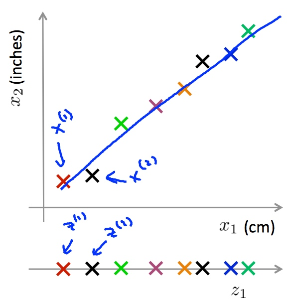
    * When the features are highly correlated, they can be combined into a single attribute.
    * It can speed up our algorithms and reduce the spaces.
    * Another example: 3D -> 2D
        * 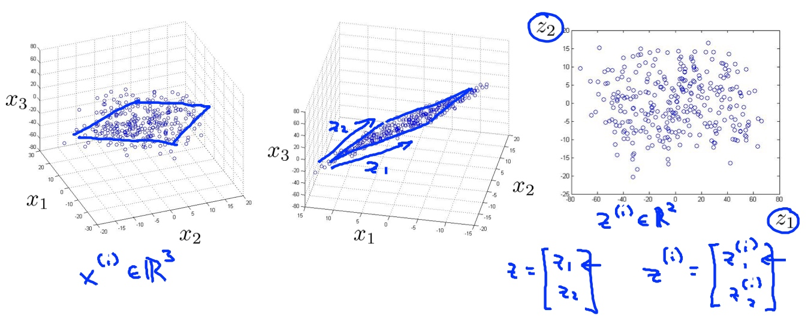

2. **Visualization**
    * It's hard to visualize highly dimensional(>3D) data. So we can reduce the dimension to help us to understand the data better.
    * For example, collect a large data set about many facts of a country around the world:
        * 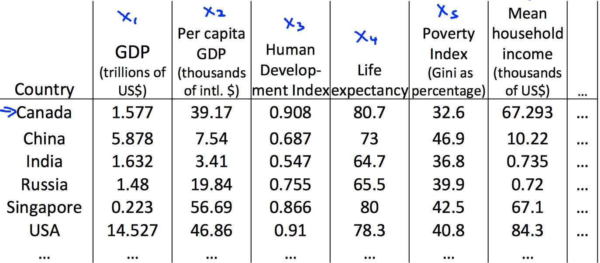
        * If we reduce the dimension to 2D:
            * 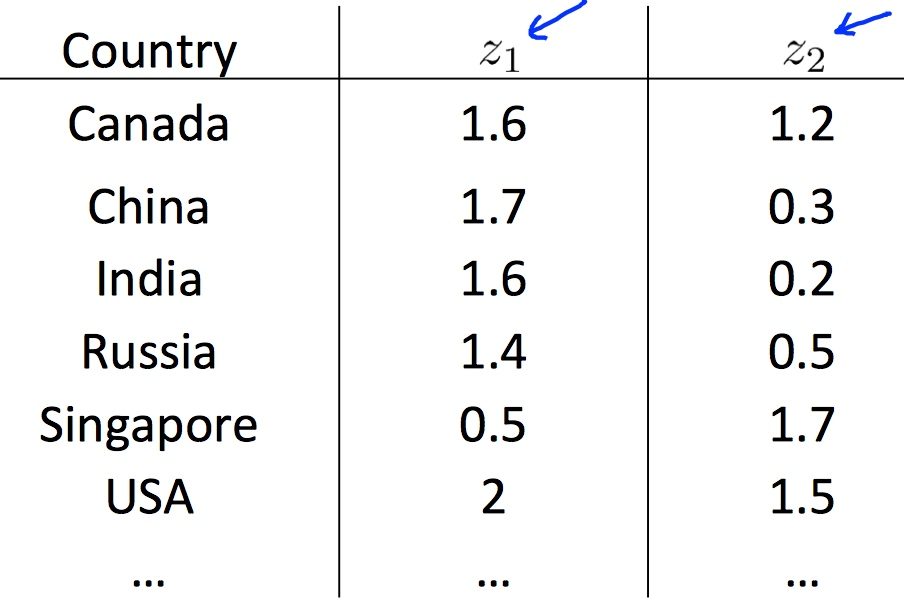
        * Then visualize:
            * 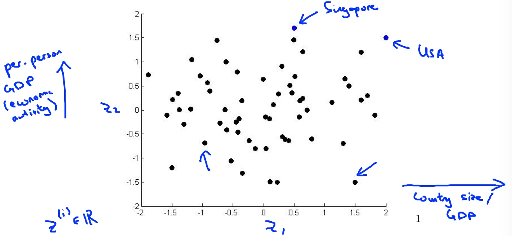

### Principal Component Analysis(PCA)

#### Problem Formulation

* Say we want to reduce a 2D data to 1D:
    * 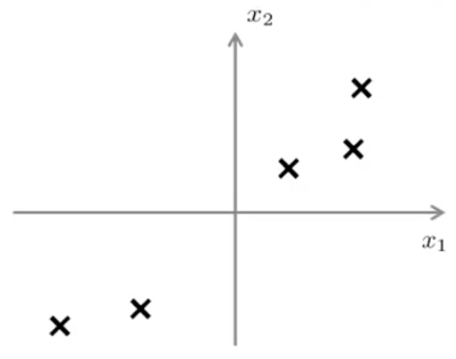
    * In other words, find a single line which to project the data, and minimize the distance between each point and the line.
    * This distance we call it **projection error** (the blue lines below):
        * 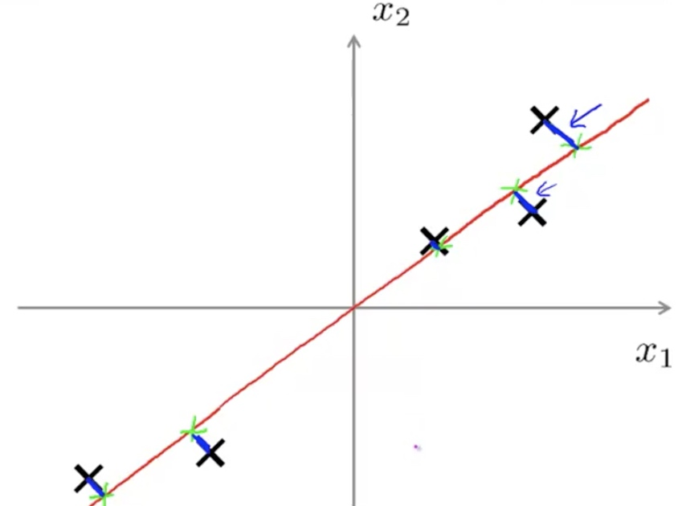
* A more formal description is:
    * Reduce from **2**-dimension to **1**­‐dimension: Find a direction (a vector \\(u^{(1)} \in \mathbb{R}^n\\))onto which to project the data so as to minimize the projection error.
* More general:
    * Reduce from **n**-dimension to **k**­‐dimension: Find **k** vectors \\(u^{(1)}, u^{(2)}, \ldots, u^{(k)}\\)) onto which to project the data so as to minimize the projection error.

* **PCA is not linear regression**
    * 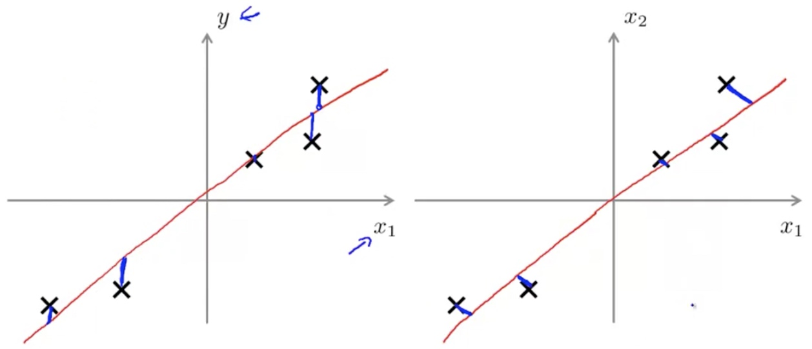
    * Linear regression is trying to minimize the distance **vertically**
    * PCA is trying to find the shortest orthogonal distances.

#### Algorithm

* Before applying PCA, we must do data preprocessing.
* **Data Preprocessing**
    * Training set: \\(x^{(1)}, x^{(2)}, \ldots, x^{(m)}\\)
    * Preprocessing (To have comparable range of values):
        * feature scaling [Lecture 12(Computational Thinking)](https://cs.ericyy.me/computational-thinking/lecture-12.html#choose-feature-vectors)
            * Z-scaling
                * Each feature has a mean of 0 & a standard deviation of 1
            * Interpolation
                * Map minimum value to 0, maximum value to 1, and linearly interpolate
        * mean normalization
            * rescale the mean of each feature set to 0
* **Algorithm**
    * Reduce data from **n**-dimensions to **k**-dimensions. Then project the data set to **k** dimensions.
        * the **k**-dimensions, denoted by **k** vectors (\\(u^{(1)}, u^{(2)}, \ldots, u^{(k)}\\))
        * And the projected data sets denoted by (\\(z^{(1)}, z^{(2)}, \ldots, z^{(n)}\\))
    * Compute "covariance matrix": \\[\Sigma = \frac{1}{m}\sum_{i=0}^n (x^{(i)})(x^{(i)})^T\\]
        * \\(\Sigma\\): Sigma, [n x n] matrix
        * `Sigma = (1/m)*(X'X)`
    * Compute "eigenvectors" of matrix \\(\Sigma\\): 
        * In Matlab: `[U, S, V] = svd(Sigma);`
            * `svd`: singular value decomposition
        * `U,S,V`: Matrix
            * 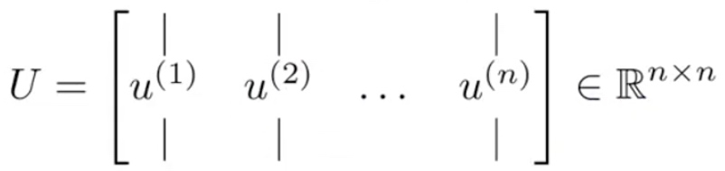
            * And we are going to take the first **k** columns of U to find \\(z\\), which will be a [n x k] matrix. We call this matrix **U_reduce** matrix.
            * Then \\(z = U_{\text{reduce}}'X\\), and z will be a \\((k \times 1)\\) vector.
    * In summay:
        * `[U, S, V] = svd(Sigma);`
        * `Ureduce = U(:, 1:k);`
        * `z = Ureduce'*x;`

### Applying PCA

#### Reconstruction from Compressed Representation

* \\(x_{\text{approx}}^{(1)} = U_{\text{reduce}} z^{(1)}\\)
    * \\(x_{\text{approx}}^{(1)}\\): [n x 1]
    * \\(U_{\text{reduce}}\\): [n x k]
    * \\(z^{(1)}\\): [k x 1]
* And we want to minimize the difference between \\(x_{\text{approx}}\\) and \\(x\\)

#### Choosing the Number of Principal Components(k)

* Choosing **k**(Number of Principal Components)
* Average squared projection error: \\[\frac{1}{m} \sum_{i=1}^m \lVert x^{(i)} - x_{\text{approx}^{(i)}} \rVert ^2\\]
* Total variation in the data: \\[\frac{1}{m} \sum_{i=1}^m \lVert x^{(i)} \rVert ^2\\]
* Typically, choose **k** to be smallest value so that \\[\frac{\frac{1}{m} \sum_{i=1}^m \lVert x^{(i)} - x_{\text{approx}^{(i)}} \rVert ^2}{\frac{1}{m} \sum_{i=1}^m \lVert x^{(i)} \rVert ^2} \le 0.01 \\]
    * In other words, 99% of variance is retained.
* Back to the `svd` function(`[U, S, V] = svd(Sigma)`), we get **S**, which is a diagonal matrix, and \\[\frac{\frac{1}{m} \sum_{i=1}^m \lVert x^{(i)} - x_{\text{approx}^{(i)}} \rVert ^2}{\frac{1}{m} \sum_{i=1}^m \lVert x^{(i)} \rVert ^2} = 1 - \frac{\sum_{i=1}^k S_{ii}}{\sum_{i=1}^n S_{ii}} \le 0.01\\]
    * So instead calculating all of the data set, we can just use **S** to find the **k**.

#### Advice for Applying PCA

* **Supervised learning speedup**
    * \\((x^{(1)}, y^{(1)}), (x^{(2)}, y^{(2)}), \ldots, (x^{(m)}, y^{(m)}) \\)
    * Extract inputs:
        * Unlabeled dataset: \\(x^{(1)}, x^{(2)}, \ldots, x^{(m)} \in \mathbb{R}^{10000} \ \underrightarrow{PCA} \ z^{(1)}, z^{(2)}, \ldots, z^{(m)} \in \mathbb{R}^{1000} \\)
    * New training set:
        * \\((z^{(1)}, y^{(1)}), (z^{(2)}, y^{(2)}), \ldots, (z^{(m)}, y^{(m)}) \\)
    * Note: Mapping \\(x^{(i)} \rightarrow z^{(i)}\\) should be defined by running PCA **ONLY** on the training set. This mapping can be applied as well to the examples \\(x_{cv}^{(i)}\\) and \\(x_{test}^{(i)}\\) in the cross validation and test sets.
* **Application of PCA**
    * Compression
        * Reduce memory/disk needed to store data 
        * Speed up learning algorithm
    * Visualization
* **Bad use of PCA: To prevent overfitting**
    * Might work OK, but isn't a good way to address overfitting. Use regularization instead.
* **When Design a ML system,**
    * You should first consider the whole thing without PCA. Use the raw data first. Only if that doesn't do what you want, like, exceed the memory, disk space, etc., then implement PCA.

